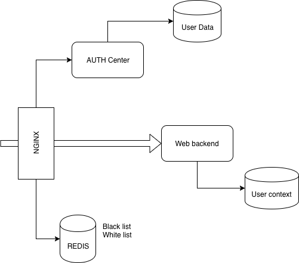

# nginx Authentication

Аутентифика́ция (англ. authentication < греч. αὐθεντικός [authentikos] «реальный, подлинный» < αὐτός [autos] «сам; он самый») — процедура проверки подлинности, например:

проверка подлинности пользователя путём сравнения введённого им пароля (для указанного логина) с паролем, сохранённым в базе данных пользовательских логинов

Авториза́ция (англ. authorization «разрешение; уполномочивание») — предоставление определённому лицу или группе лиц прав на выполнение определённых действий; а также процесс проверки (подтверждения) данных прав при попытке выполнения этих действий. Часто можно услышать выражение, что какой-то человек «авторизован» для выполнения данной операции — это значит, что он имеет на неё право.

Аутентификация -- Получения ключа для выполнения действий
Авторизация -- Проверка прав доступа по ключу Аутентификации

## Nginx + Lua

### Nginx

Наружу доступен nginx и только через nginx доступны другие сервисы

Nginx выступает в роли revers proxy + балансировщик(при необходимости)

Nginx-у доступен внутри сети сервис "Auth Center" и метод "check_jwt"

Whitelist и Blacklist хранятся в REDIS, чтобы не разбирать JWT

Проксируем запросы на "Auth Center" для пользователя, без ограничений

### Lua

Запускается перед proxy_path, имеет подключение к Redis

На этом уровне мы должны гарантировать, что если есть заголовок Authentication в запросе, то он действительный и валидный

REDIS Lists raw exired:
- Whitelist == по времени жизни токена минус 2 секунды [Проблема 1]
- Blacklist == 30 минут

*Получили токен, проверяем его в списках*

- REDIS Whitelist -> Перенаправляем дальше
- REDIS Blacklist -> Отвечаем 403

*Если токена нет в списках White/Black -- Разбираем его*

- Проверяем на валидность. 
- Не валидный -> В Blacklist
- Валидный -> Отправляем запрос на "Auth Center:check_jwt"
- Получаем 403 -> Кладем в Blacklist
- Получаем 200 -> Кладем в Whitelist, перенаправляем дальше

## Auth Center

Имеет подключение к REDIS

Занимается:
- выдачей/проверкой/обновлением JWT
- Xранит базу пользователей
- Регистрирует новых пользователей
- Форма авторизации по паролю
- Авторизация по одноразовому коду
- Авторизация по oauth
- Содержит механику обмена Oauth токена на данные пользователя

### Методы:

- check_jwt
    
    Получает JWT, разбирает его, проверяет статус пользователя, возвращает результат
    
- refresh_token
    
    Принимает refresh token и JWT. Проверяет JWT на blacklist 
    Генерирует новый. Старый отправляет в blacklist с expired == его времени жизни
    Новый -- в whitelist по времени его жизни

- logout
    
    Принимает JWT, кладет его в blacklist

- login

    Генерирует JWT/refresh token, кладет его в whitelist 

## Инструкция генерации SSL ключа

    openssl req -x509 -nodes -days 365 -newkey rsa:2048 -keyout /etc/ssl/private/nginx-auth.key -out /etc/ssl/certs/nginx-auth.crt

    openssl dhparam -out /etc/ssl/certs/nginx-auth.pem 2048

## Проблемы
1.  JWT протух, пока шел от nginx до сервиса